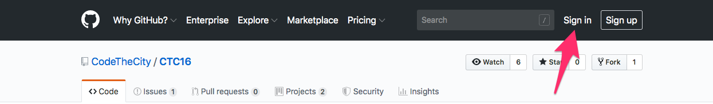
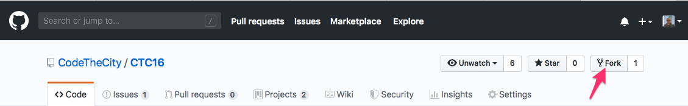
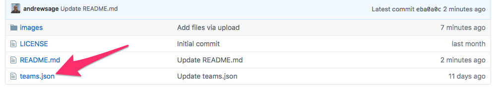
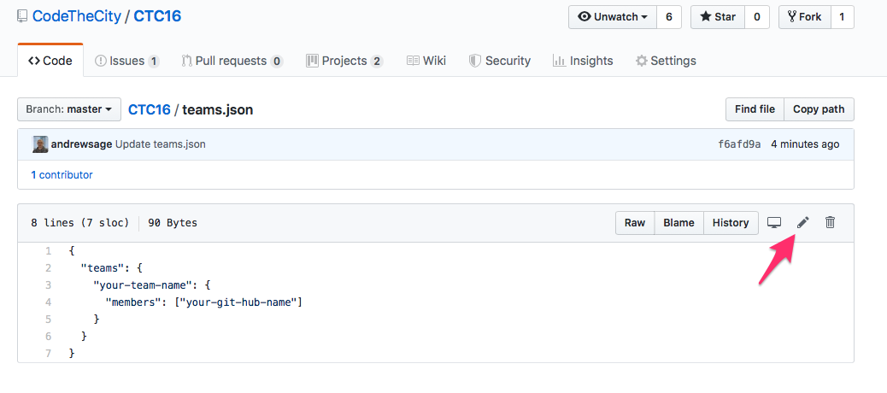
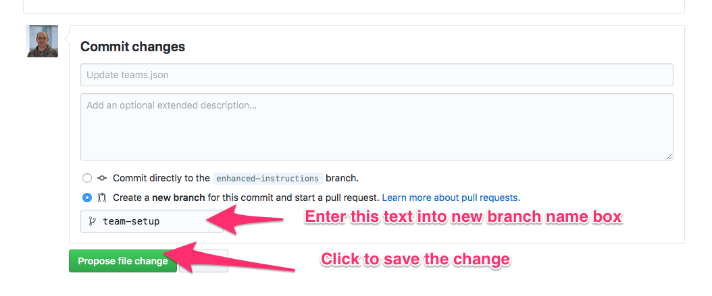

# CTC16
The homepage for CTC16 - Air Quality 2 event 8/9 June 2019 at the University of Aberdeen

## Prerequisites

* If you don't have a GitHub account, create a free account before you begin.
You can [join GitHub](http://github.com/join) to get started.

## Teams
We'll add teams during the event. Follow these steps to help us add you.
1. If you haven't already, sign in to GitHub

2. Click Fork in the top right corner of the reposity page to create your own Fork

3. It will take a few seconds for the fork process to complete.
4. Once complete you will now be at **your own** copy of this repository, which is a duplicate of the original. Any changes you make here will not affect the original.
5. View the **teams.json** file.

6. Open the file for editing by clicking on the pencil icon.

7. Change **your-team-name** to the name of your team. **Ensure - are used for spaces**
8. Change **your-git-hub-name** to the name of your GitHub account.
9. Commit the changes by creating a **new branch** with the name **team-setup** and clicking on **Propose file change**.

3. Edit this page by adding your name and team name to the file

4. Commit the changes as a new branch
- [ ] Add screen shot here to show the process
5. Submit a pull request on the repo. Now we have your Github details and know which team you belong to.
- [ ] Add screen shot here to show the process
6. We'll then create the team repos for you to use.

## Having problems?
This process relies on several online services running. Here is the checklist of their status pages just to double check:

* [Glitch](https://status.glitch.com)
* [GitHub](https://www.githubstatus.com)
