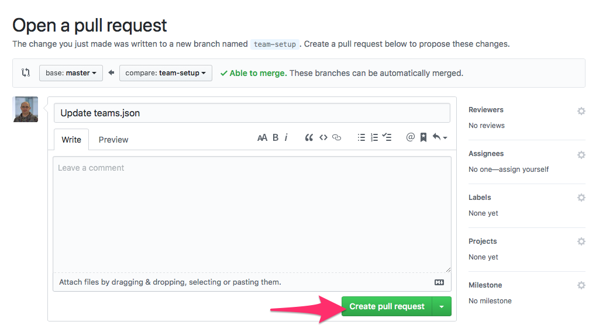

# CTC16
The homepage for CTC16 - Air Quality 2 event 8/9 June 2019 at the University of Aberdeen

## Prerequisites

* If you don't have a GitHub account, create a free account before you begin.
You can [join GitHub](http://github.com/join) to get started.

## Learning
Through this setup process you can learn the following GitHub skills:
* Forking a GitHub repository
* Editing a repository using the web browser
* Creating a Pull Request
* Contributing to a project

## Teams
We'll add teams during the event. Follow these steps to help us add you.
1. If you haven't already, sign in to GitHub

2. Click Fork in the top right corner of the reposity page to create your own Fork

3. It will take a few seconds for the fork process to complete.

4. Once complete you will now be at **your own** copy of this repository, which is a duplicate of the original. Any changes you make here will not affect the original.

5. View the **teams.json** file.

6. Open the file for editing by clicking on the pencil icon.

7. Change **your-team-name** to the name of your team, **ensuring the following**:
    * instead of spaces you use - 
    * you use the same team name as the rest of your team

8. Change **your-git-hub-name** to the name of your GitHub account.

9. Commit the changes by creating a **new branch** with the name **team-setup** and clicking on **Propose file change**.

10. Open a pull request by clicking on **Create pull request**. You do not need to change any of the fields. This will put forward a request to allow your changes to be accepted

11. We will be notified of the request and will then create the team repos for you to use.

## Having problems?
This process relies on several online services running. Here is the checklist of their status pages just to double check:

* [Glitch](https://status.glitch.com)
* [GitHub](https://www.githubstatus.com)
