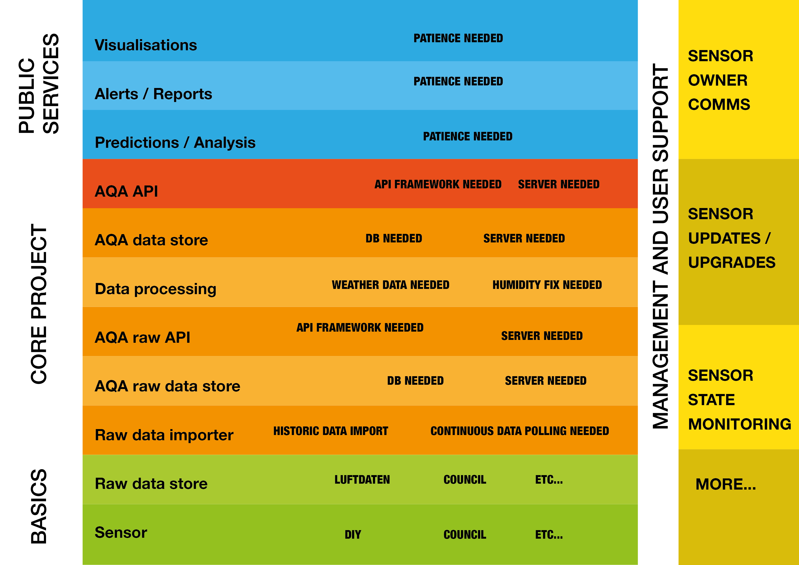
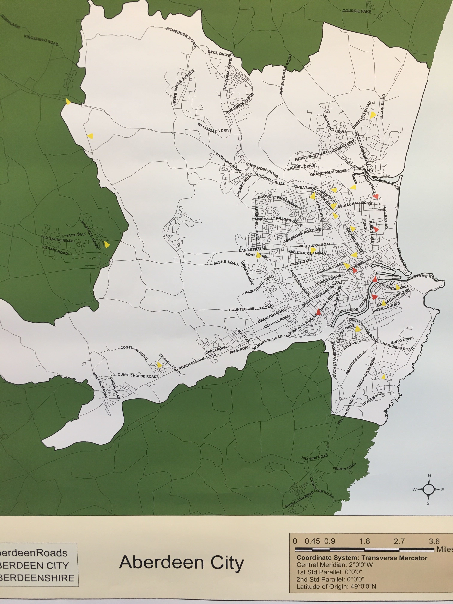

# CTC16
The homepage for [CTC16 - Air Quality 2 event](https://codethecity.org/hack-weekends/code-the-city-16-air-quality-2/) 8th/9th June 2019 at the University of Aberdeen. This event built upon the work done at [CTC15 Air Quality Hack](https://github.com/CodeTheCity/CTC15).

### Sponsors made it happen
We had a number of sponsors for the event.
[FortyTwo Studio](https://www.fortytwo.studio) covered food for our 28 (Saturday) and 24 (Sunday) hungry participants.
[Converged Communication Solutions](https://www.converged.co.uk) and [Codify](https://www.codify.ltd.uk) each paid for 10 air quality sensors for us to build and deploy in the city.

Please also take a look at some of the ideas suggested so far on our [Ideas platform](http://ideas.codethecity.co.uk/codethecity/ctc16-air-quality-2)

## TEAMS

### [Webby-Wonders](https://github.com/CodeTheCity/CTC16-Webby-Wonders)
The team is rewritting the website for Air Aberdeen so that it provides more information for visitors so that they know why they should care about air quality, and how they can get involved.

### [Data-Gathering](https://github.com/CodeTheCity/CTC16-Data-Gathering)
Exploring API development to pull sensor data for specified dates.

### [Air-Champs](https://github.com/CodeTheCity/CTC16-Air-Champs)
Visualising the data with dashboards to make it easier to see the air that matters to you

### [Implaqable](https://github.com/CodeTheCity/CTC16-Implaqable)
Team exploring how to persuade people to 'do the right' thing to help improve air quality

### [Mike-And-Robb](https://github.com/CodeTheCity/CTC16-Mike-and-Rob)
Team working with hardware to help visualise air quality in a variety of ways.

### Other work

#### Data Layers
A key part of the weekend was unpacking the different ways that the teams approached the various parts of the layers shown in the diagram below. We worked on various parts in order to eventually be able to move fully up and down the layers using appropriate interfaces to connect the layers together.

#### Map of Sensors
We also plotted sticky triangles showing AQA sensors (yellow) and Aberdeen City Council ones (red) on a map to see where the main zones are that we're not capturing, so that we can discuss how we might have sensors deployed in these spaces. We also considered how we might plot schools, and other areas on the map too. Eventually, we expect this to be online.

